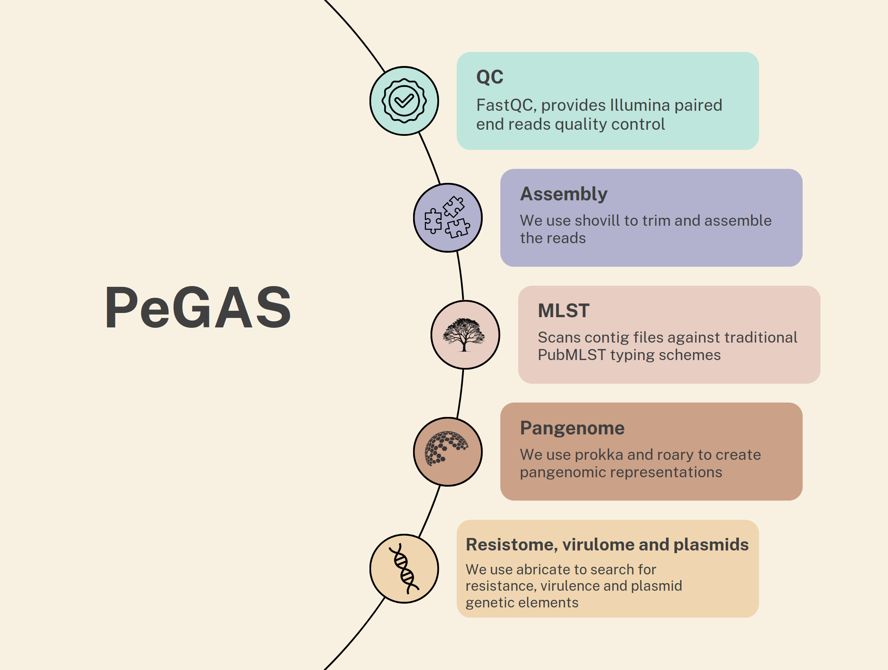

# PeGAS: A Comprehensive Bioinformatic Solution for Pathogenic Bacterial Genomic Analysis

This is PeGAS, a bioinformatic tool designed for seamless QC, assembly, and annotation of Illumina paired-end reads from pathogenic bacteria. It integrates widely used open-source tools to deliver reproducible genomic analysis and reporting.

## Key Features

- **Quality Control:** FastQC-based QC for Illumina paired-end reads.
- **Assembly:** De novo assembly using SPAdes (via Shovill).
- **Annotation:** Abricate for gene profiling and Prokka for pangenome inputs.
- **Reports:** Clean, static R HTML report by default, with an optional interactive HTML report.
- **GUI:** Launch a simple GUI to configure runs without remembering CLI flags.
- **Parallel execution:** Multi-core execution across pipeline steps, with per-tool core controls.




## How to Use

### 1. Prerequisites

- **Conda** (Miniforge or Miniconda recommended)

To check your conda install:

```bash
(base)user@user:~$ conda info
```

If you **don't have conda yet installed**, we recommend Miniforge: https://conda-forge.org/download/

### 2. pegas vs pegas-lite

- **pegas:** Best for **many samples** and **high-throughput** runs, with **more RAM** and **disk space** available. Uses **Snakemake** (requires `mamba`).
- **pegas-lite:** Best for **fewer samples** and **limited RAM/disk space**. **No Snakemake** (no `mamba` required).

### 3. Installing pegas (Snakemake)

Install `mamba` once in your base conda environment:

```bash
(base)user@user:~$ conda install conda-forge::mamba
```

```bash
(base)user@user:~$ conda create -n pegas -c bioconda -c conda-forge pegas
(base)user@user:~$ conda activate pegas
```

### 4. Installing pegas-lite (no Snakemake)

```bash
(base)user@user:~$ conda create -n pegas-lite -c bioconda pegas-lite
```

This creates a new environment called `pegas-lite` and installs the package from `bioconda`. Activate it with:

```bash
(base)user@user:~$ conda activate pegas-lite
```

### 5. Running from the CLI

- Copy your `fastq.gz` files into a working folder (separate from the install path).
- Run the pipeline from the activated environment:

```bash
pegas -d /path/to/fastqs -o /path/to/output --cores 16 --overwrite
```

Full usage (same for `pegas-lite`):

```bash
usage: pegas [-h] -d DATA -o OUTPUT [-c CORES] [--overwrite]
             [--shovill-cpu-cores SHOVILL_CPU_CORES]
             [--prokka-cpu-cores PROKKA_CPU_CORES]
             [--roary-cpu-cores ROARY_CPU_CORES]
             [--gc GC] [--interactive]

Run the PeGAS pipeline.

options:
  -h, --help            show this help message and exit
  -d DATA, --data DATA  Directory with fastq.gz files
  -o OUTPUT, --output OUTPUT
                        Directory for outputs
  -c CORES, --cores CORES
                        Total cores to use (default: all)
  --overwrite           Overwrite the output directory if it exists
  --shovill-cpu-cores SHOVILL_CPU_CORES
                        Number of CPU cores to use for Shovill
  --prokka-cpu-cores PROKKA_CPU_CORES
                        Number of CPU cores to use for Prokka
  --roary-cpu-cores ROARY_CPU_CORES
                        Number of CPU cores to use for Roary
  --gc GC               Custom JSON with GC content limits per species
  --interactive         Generate the interactive HTML report (optional)
```

A model for the GC JSON file can be found here:
https://github.com/liviurotiul/PeGAS/blob/main/src/pegas/gc_content.json

### 6. Reports and GUI

- **Default report:** `report/report_r.html` (clean, static, shareable)
- **Interactive report (optional):** add `--interactive` to generate `report/report.html`
- **GUI:** run `pegas` or `pegas-lite` with no arguments to launch the GUI. The GUI mirrors the CLI flags.

### 7. Visualising the results

After processing completes, check the `report/` folder and the `results/` folder inside the output directory.

### PeGAS works out of the box on Linux systems. For Windows and macOS, we recommend using virtualization software like Docker or WSL.

### 8. Citation

Liviu-Iulian Rotaru, Marius Surleac, PeGAS: a versatile bioinformatics pipeline for antimicrobial resistance, virulence and pangenome analysis, Bioinformatics Advances, Volume 5, Issue 1, 2025, vbaf165, https://doi.org/10.1093/bioadv/vbaf165
